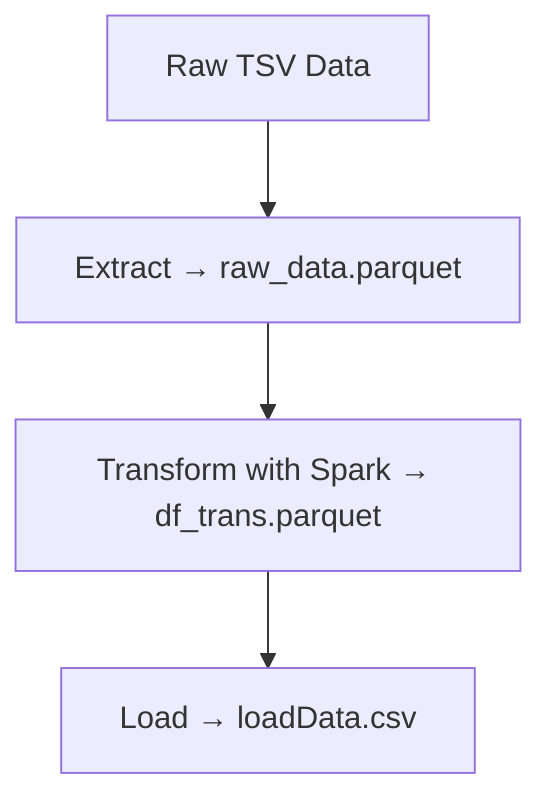

#  Food ETL Pipeline with Spark & Airflow

## 📌 Overview
An **end-to-end ETL pipeline** built with **Apache Spark** and **Apache Airflow** to process the [OpenFoodFacts dataset](https://world.openfoodfacts.org/).  
The pipeline ingests raw `.tsv` files, cleans and transforms data at scale, and outputs **analytics-ready datasets** in Parquet and CSV formats.  

---

## 🔄 ETL Workflow

### 1️⃣ Extraction (`extract` task)
- Reads raw `.tsv` file with **Pandas**  
- Handles schema inconsistencies by loading all columns as strings  
- Stores raw data as **Parquet** → `raw_data.parquet`  

---

### 2️⃣ Transformation (`spark_jobs/transform_job.py`)
- Executed by **SparkSubmitOperator**  
- Key steps:  
  - Select relevant fields:  
    `product_name, brands, categories, ingredients_text, fat_100g, sugars_100g, salt_100g, nutrition_grade_fr, countries`  
  - Normalize **brands & categories** → lowercase, first value only  
  - Clean **ingredients_text** → remove special characters  
  - Replace nulls in nutrition values with `-1`  
  - Standardize countries → `"United States" → US`, `"United Kingdom" → UK`  
- Saves transformed data → `df_trans.parquet`  

---

### 3️⃣ Loading (`load` task)
- Reads transformed parquet  
- Exports final dataset as **CSV** → `loadData.csv`  

---

### 4️⃣ Orchestration (`food_data_dag.py`)
- Managed by **Apache Airflow**  
- Weekly schedule (`@weekly`)  
- Enforced order:  
  1. `extract`  
  2. `transform_with_spark`  
  3. `load`  
- Includes retry, logging, and modular DAG design  

---

## 🛠️ Setup & Run

### 1. Clone Repository
```bash
git clone https://github.com/MariamAboelfadl/food_etl_with_spark_airflow.git
cd food_etl_with_spark_airflow
```

### 2. Install Requirements
```bash
pip install -r Requirements.txt
```

### 3. Start Airflow & Spark
```bash
docker-compose up -d
```

### 4. Access Airflow UI
- URL → `http://localhost:8080`  
- Credentials → defined in `docker-compose.yaml`  

---

## 📊 Pipeline Flow


---

## 📈 Key Learnings
- ✅ Designed a **weekly ETL pipeline** using Spark + Airflow  
- ✅ Implemented **data cleaning & normalization** at scale  
- ✅ Used **Docker Compose** for reproducible local deployment  


---

## 🚧 Future Enhancements
- ☁️ Extend to **cloud data lakes** (S3, GCS)  
- ⚡ Optimize Spark with **partitioning, caching, cluster mode**  


